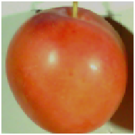
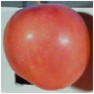
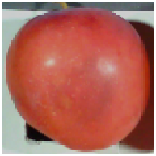
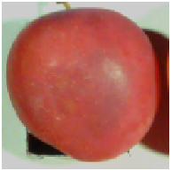

#  Bruise Finder 🍒🔍 

This is the code for bruise detection and categorization in plum fruit

#  Key Features 🔑 
A convolutional neural network (CNN) model that leverages 3D convolutional layers to integrate spatial and spectral features from hyperspectral data, enabling accurate bruise analysis in plum fruit. 

Capable to monitor bruise development over time (30 minutes, 1 hour, 3 hours, 6 hours, 12 hours, 24 hours, and 48 hours).

Model equipped with early bruise detection.

# Sample Images 📷

 Unbruised
 Bruised(6 hour)
Bruised(12 hour)
 Bruised(48 hour)

# Data 💾 
Download sample data [here](https://drive.google.com/file/d/1zSMGakhsenXTL4AzUN68OGVbuOdDq3CP/view?usp=drive_link).                                                                                  
Download pre-trained weights [here](https://drive.google.com/file/d/1lrrXnaK_AN7pkNMgXPxT-J6yTcCHQbk6/view?usp=drive_link)

# Requirements 🔧

Matlab 2024a.

# How to train 🎓 
  Download the data using the link given above.  Run the main code SSCNNcode.m

# Code Release 📂

The full code will be made available following the publication of the paper.
